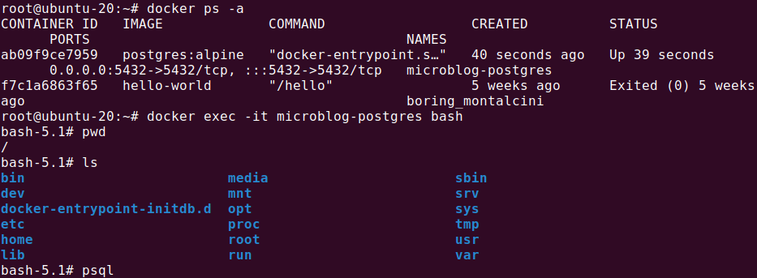
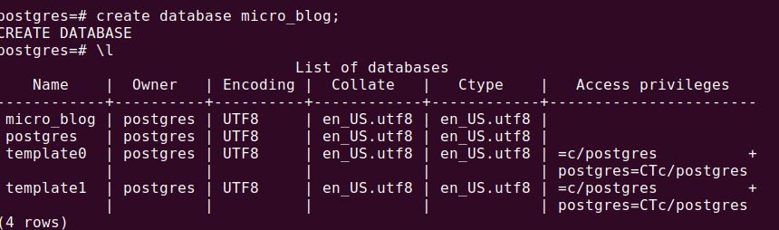
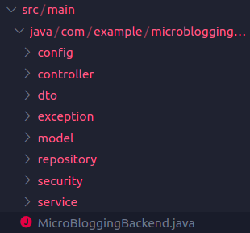

# This is the back-end for a micro blogging site developed using spring-boot

This project is under development. The front-end will consume the ```REST API``` served by Spring-boot. the project has several core components. For databse I have used Postgres.

## Database
---
I used the postgres docker image to run the databse. To replicate the process run the following commands

```bash
docker pull postgres:alpine
```

This will pull the ```postgres``` docker image. now we need to build a container and run it in ```exec``` to bash ```into``` the container and run commands.

```bash
sudo docker run --name microblog-postgres -e POSTGRES_PASSWORD=root -d -p 5432:5432 postgres:alpine
```
Here we are running a container and named it ```microblog-postgres``` and we are running on ```port 5432``` this with ```port``` forwarding. Once we are running the container we need to ```bash``` into it. 
```bash
sudo docker ps
docker exec -it microblog-postgres bash
```
We can see the output below with linux file system



Now we just create a ```user``` and a database named ```micro_blog```
```bash
psql -U postgres
create database micro_blog;
```
Below we can see we have successfully created a database for our ```Spring-boot Project```



## Spring-boot
---
Our project has several api end points. If we look at the Project Structure first we can have an idea about the workings and logics. We can see our api end-points in the table below.

| No. |            End-points            | Type | Parameters                                                    |                                Description                               |
|:---:|:--------------------------------:|------|---------------------------------------------------------------|:------------------------------------------------------------------------:|
| 1   | /api/auth/signup                 | Post | Input-> RegisterRequestDto Returns-> RequestDto               | Takes username,password and Email to register user.                      |
| 2   | /api/auth/login                  | Post | Input-> LogintDto Returns-> JWT token                         | Takes username and password. if the user is valid it returns a JWT token |
| 3   | /api/posts/                      | Post | Input->  PostDto Returns-> HttpStatus                         | Creates new post in the database                                         |
| 4.  | /api/posts/all                   | Get  | Input-> 0 Returns-> List if post as json                      | Returns all the available post                                           |
| 5   | /api/posts/get/{id}              | Get  | Input-> ID Returns-> One post as json                         | Takes an as a Path Variable and returns that post                        |
| 6.  | /api/comments                    | Post | Input-> CommnetsDto Returns-> HttpStatus                      | Creates new Comments and saves them in the database                      |
| 7.  | /api/comments//by-post/{postId}  | Get  | Input-> ID Returns-> List of comments as json                 | Takes a post ID as parameter and returns comments of that Post only      |
| 8.  | /api/comments/by-user/{userName} | Get  | Input-> Username as String Returns-> list of commnets as json | Takes a username and returns all the comments of that user.              |
| 9.  | /api/votes/                      | Post | Input-> VoteDto Returns-> HttpStatus                          | This adds the new votes to posts takes postID from request body.         |
---

Now if we look at our folder structure we will have better idea of the services and components.



* ```config```: This package contains 2 files for web and security configuration

* ```Controller```: In this package we deal with all the ```API``` end points. This is where we used the Spring Rest Controller
* ```dto```: This is where we are basically designing how our data is received and exposed outside. This is kind of sanitizer for our data pipeline. Dto's are not mandatory but they help.

* ```exception```: Here we declared some custom Exception for our web app

* ```model```: In this package we designed our entity and models. This models are used to create our database schema by hibernate.
* ```repository```: This is where we do our db read and write. CRUD and other custom database operations goes here
* ```security```: Here we configured our JWT operations. We have only 2 files here.
* ```service```: At last we have services. This package is where all our logics goes into work. For example how do we use that JWT token we configure here.

### The project is not complete. I will add the following features:

* Swagger for API Documentation (Swagger is added in the project and in some of the classes but not fully configured)
* The PostService and Comment service is still not working as they should. I'll fix this by using map() function. This error is currently in the project.
* Develope an UI. I only have the login page completed for now. I'll complete the Front-end
* I did not sanitize my inputs. So faulty user inputs passes though the dto's. For example multiple user can have the same user name. There is no checker for now.


